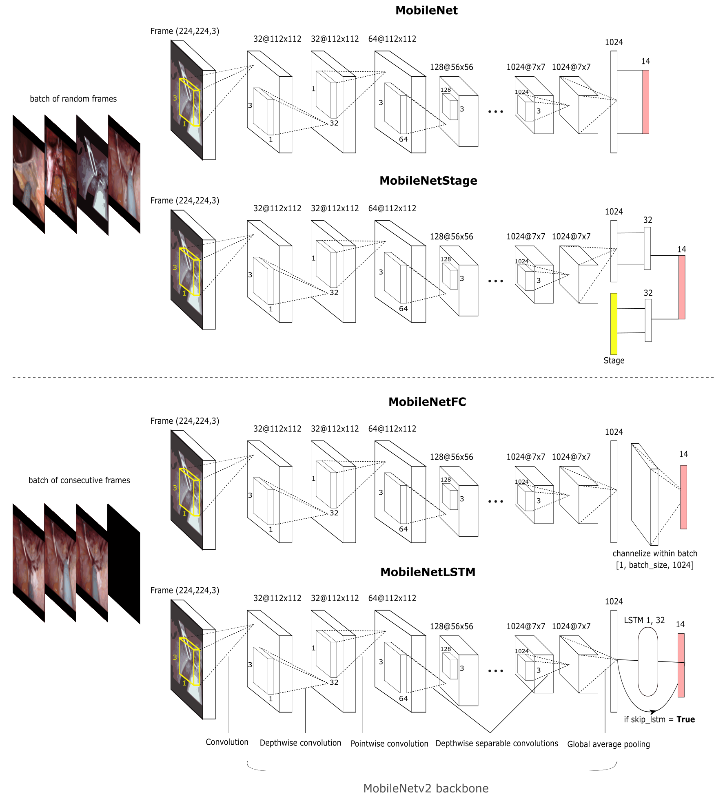

# Phase detection in hernia surgery

This project aims at classifying frames of hernia surgery videos. The target labels are the phases of the operation and are listed below in alphabetical order.

| Label             | Corresponding phase       |
| ----------------- | ----------- |
| 0             | adhesiolysis       |
| 1             | blurry       |
| 2             | catheter insertion       |
| 3             | mesh placement       |
| 4             | mesh positioning      |
| 5             | out of body      |
| 6             | peritoneal closure       |
| 7             | peritoneal scoring       |
| 8             | positioning suture       |
| 9             | preperioneal dissection      |
| 10             | primary hernia repair      |
| 11             | reduction of hernia      |
| 12             | stationary idle       |
| 13             | transitionary idle       |

## Preprocessing

Unwrap videos and save the resized frames (224 x 224 x 3).

```
python videos-to-images.py
```

## Models


